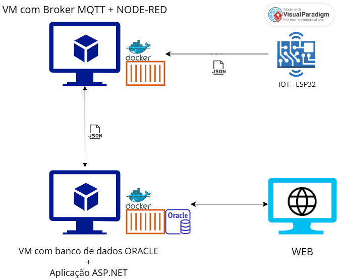

# $FonteViva – Estação-IoT-Autônoma$

Solução voltada ao **monitoramento de recursos hídricos** em cenários de risco e emergência, utilizando sensores físicos, rede MQTT e persistência em banco de dados Oracle via API.


> Uma solução integrada para o armazenamento, reaproveitamento e tratamento inteligente da água, com controle remoto e análise de qualidade em tempo real.

## **Sobre o Projeto**

O **FonteViva** é uma mini estação de tratamento de água projetada para ser portátil, empilhável e de rápida instalação, atuando tanto em cenários de escassez quanto de excesso de água. Ela integra tecnologias sustentáveis, IoT e energia solar para garantir autonomia e eficácia.

### _Componentes do Sistema_

- **Tanque superior:** Armazena água bruta (capacidade: 30–40L)
- **Filtro por gravidade:** Com carvão ativado e camadas filtrantes
- **Controle eletrônico:**
  - Medição de pH, turbidez, temperatura e volume
  - Luz UV para controle microbiológico
  - Comunicação via rede local (MQTT ou HTTP)
- **Energia limpa:** Painel solar alimentando sensores e sistema

### _Estimativa de Custos da Estação FonteViva_

| Item                                   | Descrição                           | Estimativa (R\$) |
| -------------------------------------- | ----------------------------------- | ---------------- |
| Tanque plástico                        | Reservatório superior de água (40L) | R\$ 50,00        |
| Filtro por gravidade                   | Camadas de cascalho, areia e carvão | R\$ 60,00        |
| Sensor de pH                           | Medição da acidez                   | R\$ 45,00        |
| Sensor de turbidez                     | Verifica partículas em suspensão    | R\$ 40,00        |
| Sensor de temperatura                  | Monitoramento térmico da água       | R\$ 30,00        |
| Sensor de nível (ultrassônico)         | Medição de volume disponível        | R\$ 50,00        |
| Módulo UV (esterilização)              | Controle de micro-organismos        | R\$ 70,00        |
| ESP32 / ESP8266                        | Microcontrolador com Wi-Fi          | R\$ 35,00        |
| Módulo MQTT / rede local               | Comunicação dos dados               | R\$ 10,00        |
| Painel solar + controlador + bateria   | Energia limpa e sustentável         | R\$ 150,00       |
| Estrutura física (bomba, tubos, caixa) | Instalação e vedação                | R\$ 90,00        |
| Total estimado por unidade             |                                     | **\~R\$ 630,00** |

> Valores podem reduzir com a parceria de fornecedores.

### _Viabilidade_

A proposta é financeiramente acessível, de fácil transporte (empilhável como copos plásticos) e utiliza energia limpa. Ideal para contextos de emergência, comunidades isoladas ou educação ambiental.

---

## **Estrutura da solução**



---

## **Tecnologias Utilizadas**

| Tecnologia                 | Descrição                            |
| -------------------------- | ------------------------------------ |
| .NET 8                     | Backend e API REST                   |
| Oracle Database            | Persistência de dados                |
| Swagger                    | Documentação interativa das rotas    |
| Docker                     | Containerização da aplicação         |
| MQTT                       | Protocolo para sensores IoT          |
| ESP32                      | Microcontrolador com Wi-Fi embarcado |
| HTML + Razor               | Views do MVC                         |
| GitHub Actions (se houver) | CI/CD opcional para build/test       |

---

## **Organização do Projeto**

```bash
FonteViva/
├── Controllers/
├── Models/
├── DTO/
├── Repository/
├── Views/
├── Program.cs
├── appsettings.json
└── Dockerfile
```

## **Testes CRUD**

Requisições realizadas com `curl`:

### _Create - POST_

```json
{
  "cpf": "46788920677",
  "nome": "Francesco Di Benedetto"
}
```


### _Read - GET_

```sh
http://74.163.240.0:8081/api/ResponsavelApi/46788920677
```


### _Update - PUT_

```bash
{
    "cpf": "46788920677",
    "nome": "Francesco Monteiro Di Benedetto"
}
```


- Confirmação da atualização
  

### _Delete_

```sh
http://74.163.240.0:8081/api/ResponsavelApi/46788920677
```


- Confirmação da exclusão
  

---

### Acesso na Nuvem

[http://74.163.240.0:8081](http://74.163.240.0:8081)

---

## **RepositórioS**

- GitHub: [DEVOPS-TOOLS-CLOUD-COMPUTING](https://github.com/2TDSPV-GS-01/DEVOPS-TOOLS-CLOUD-COMPUTING)
- GitHub: [ADVANCED-BUSINESS-DEVELOPMENT-WITH-.NET](https://github.com/2TDSPV-GS-01/ADVANCED-BUSINESS-DEVELOPMENT-WITH-.NET)
- GitHub: [DISRUPTIVE-ARCHITECTURES-IOT-IOB-GENERATIVE-IA](https://github.com/2TDSPV-GS-01/DISRUPTIVE-ARCHITECTURES-IOT-IOB-GENERATIVE-IA)

---

## **Vídeo Demonstração**

YouTube: [https://youtube.com/seu-video](https://youtube.com/seu-video)

---

## **Integrantes**

- Nome: Francesco Di Benedetto
  RM: RM557313
- Nome: Nathalia Gomes da Silva
  RM: RM554945
- Nome: Gustavo Goulart Bretas
  RM: RM555708
